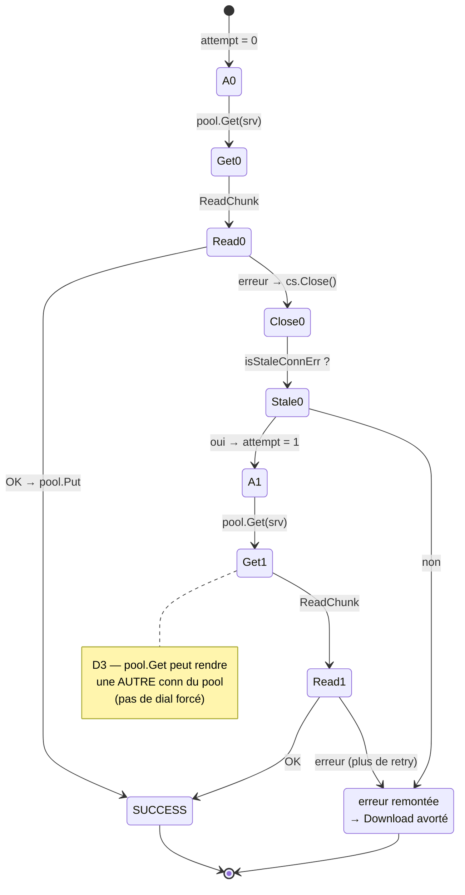
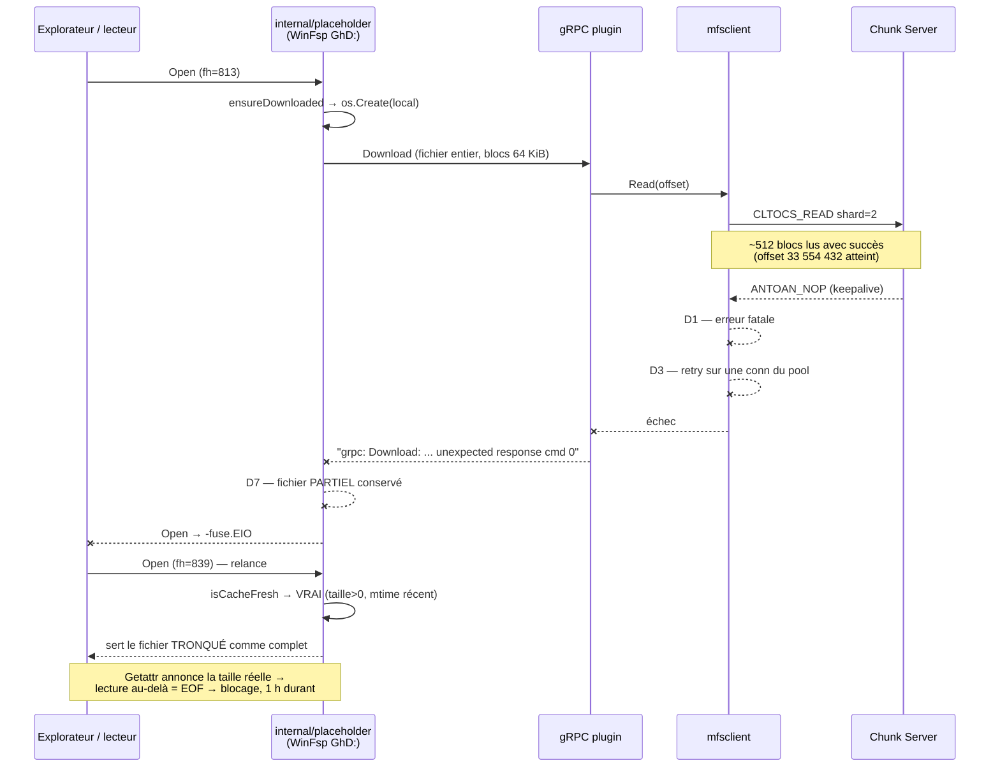
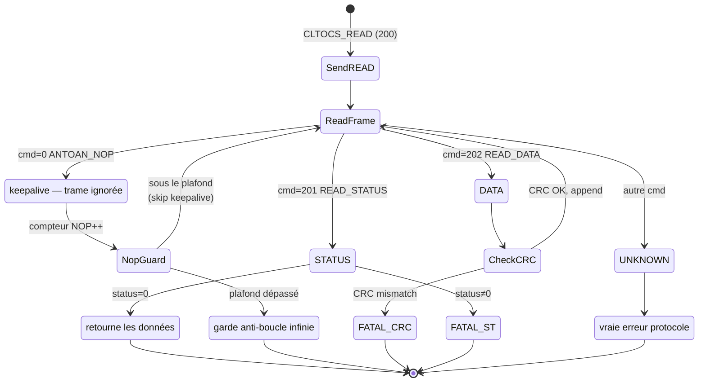
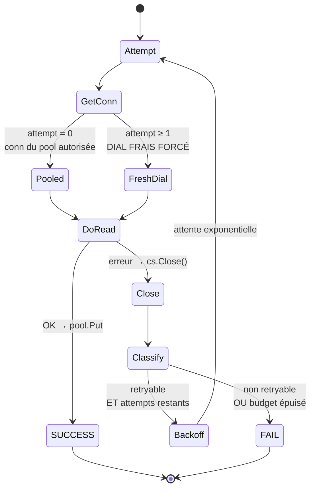
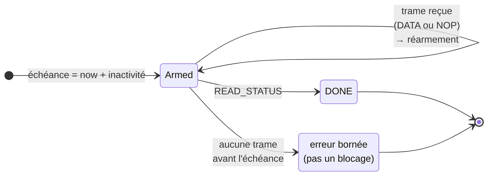
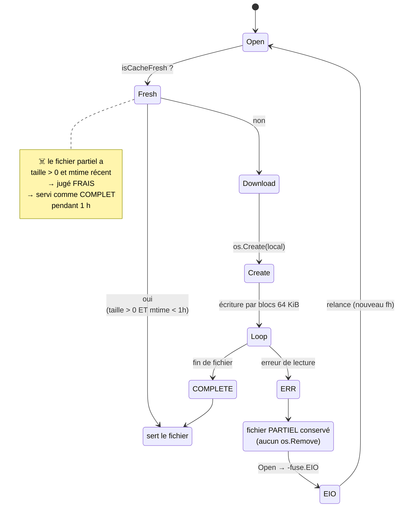
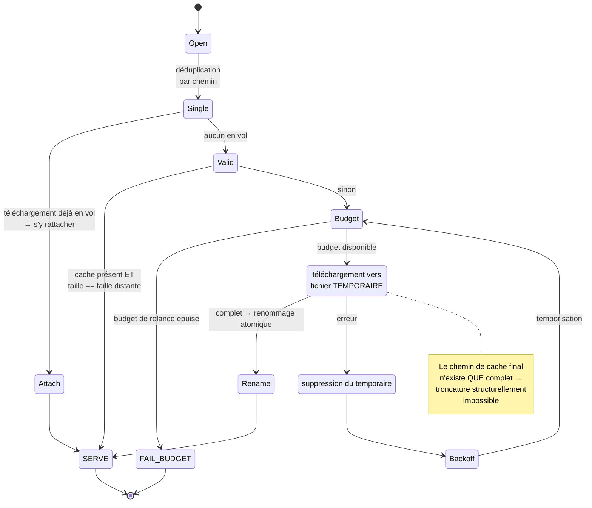

# Maquette — Machine à états lecture CS MooseFS (bugfix #160)

> Référence pour **test-writer** (dérivation des scénarios) et **QA** (validation de conformité).
> Périmètre : `plugins/moosefs/internal/mfsclient` (couches frame / ReadChunk / readEC4At) + politique de retry.

---

## 1. AVANT — comportement actuel (bugué)

### 1.1 Boucle de trames `ReadChunk` — `csclient.go:209-262`

```mermaid
stateDiagram-v2
    direction TB
    [*] --> SendREAD: CLTOCS_READ (200)
    SendREAD --> ReadFrame

    ReadFrame --> DATA: cmd=202 READ_DATA
    ReadFrame --> STATUS: cmd=201 READ_STATUS
    ReadFrame --> DEFAULT: cmd=0 (ANTOAN_NOP)

    DATA --> CheckCRC
    CheckCRC --> ReadFrame: CRC OK, append
    CheckCRC --> FATAL_CRC: CRC mismatch

    STATUS --> OK: status=0
    STATUS --> FATAL_ST: status≠0

    DEFAULT --> FATAL_NOP

    FATAL_NOP: ERREUR errUnexpectedCmd<br/>"unexpected response cmd 0"
    OK: retourne les données

    FATAL_NOP --> [*]
    FATAL_CRC --> [*]
    FATAL_ST --> [*]
    OK --> [*]
```

**Défaut D1** — la trame `ANTOAN_NOP` (cmd=0, keepalive légitime du chunk server) tombe dans
`default:` et devient une erreur fatale. Les trois autres boucles de protocole du dépôt la
sautent correctement :

| Boucle | Fichier | Traitement cmd=0 |
|---|---|---|
| Protocole master | `client.go:101` | `continue` (skip) ✅ |
| Write init ACK | `csclient.go:325` | `continue` (skip) ✅ |
| Write status reader | `csclient.go:386` | `continue` (skip) ✅ |
| **CS read loop** | **`csclient.go:255`** | **erreur fatale** ❌ |

#### Preuve 1 — le client MooseFS officiel saute le NOP dans la boucle de lecture CS

`moosefs/mfsclient/readdata.c:1682-1691` — le NOP est une branche de première classe du
dispatch, au même rang que `CSTOCL_READ_STATUS` et `CSTOCL_READ_DATA` :

```c
} else if (datasrc[part].reccmd==ANTOAN_NOP) {
    if (datasrc[part].recleng!=0) {
        mfs_log(... "readworker: got wrong sized nop packet from chunkserver ...");
        status = EIO; resetpos = 1; break;
    }
    datasrc[part].received = 0;      // ← trame ignorée, la lecture se poursuit
} else {
    ... "readworker: got unrecognized packet from chunkserver (cmd:%u,leng:%u,ip:port<->ip:port)"
}
```

Deux enseignements repris dans la cible : le NOP est **attendu** sur une connexion de lecture,
et sa longueur **doit être nulle** (un NOP mal dimensionné est une vraie erreur).

#### Preuve 2 — omission de portage depuis le POC Python

Le POC de référence `poc/ec4_reader.py`, validé contre le serveur MooseFS réel lors de
l'issue #114, saute explicitement le NOP **dans la boucle de lecture CS** :

```python
# poc/ec4_reader.py:266-270
while True:
    cmd, data = read_frame(cs)
    if cmd == ANTOAN_NOP:
        continue                    # ← ligne absente du portage Go
    if cmd == CSTOCL_READ_DATA:
```

Le POC saute également le NOP dans la boucle master (`ec4_reader.py:131`, `:184`) — et ce
saut-là **a bien été porté** (`client.go:101`). Seule la boucle de lecture CS a perdu le
`continue` lors du portage Python → Go. `ANTOAN_NOP` est donc un keepalive légitime du
protocole, pas un symptôme de connexion périmée.

Corollaire : le commentaire `csclient.go:132-144` (« le buffer TCP contient des zéros d'une
socket semi-fermée ») est erroné — une socket semi-fermée produit un EOF via `io.ReadFull`
(`protocol.go:337`), jamais une trame `cmd=0`. Le commit `a9c117a`
(*fix(moosefs): handle cmd=0 stale connection in readEC4At (#114)*) a traité le symptôme sur
la base de ce diagnostic erroné ; #160 en est la conséquence directe.

### 1.2 Politique de retry `readEC4At` — `ecclient.go:103-124`



**Défauts** :
- **D2** — `isStaleConnErr` (`csclient.go:152-166`) classe `errUnexpectedCmd` comme
  « connexion périmée », ce qui masque D1 derrière un retry qui ne corrige rien : la
  connexion fraîche reçoit un NOP au bout du même délai. Le matching par sous-chaîne
  (`"read frame header"`, `"write frame header"`) est par ailleurs trop large.
- **D3** — le retry ne garantit pas une connexion neuve : `pool.Get` (`csclient.go:91-103`)
  dépile d'abord le pool. Avec `maxIdleCSConns = 4`, jusqu'à 4 connexions périmées peuvent
  être servies d'affilée ; le retry-once s'épuise sans jamais composer.
- **D4** — aucune échéance : `DialCS` utilise `net.Dial` nu (`csclient.go:181`) ; `ReadFrame` /
  `WriteFrame` ne posent aucun `SetReadDeadline` / `SetWriteDeadline` (`protocol.go:312-355`).
  Un CS muet bloque indéfiniment → blocage complet observé.
- **D5** — les connexions du pool ne portent ni horodatage ni âge max ; combiné à l'absence de
  TCP keepalive, une connexion inactive au-delà du timeout serveur est périmée par
  construction. Chaque erreur ferme la connexion → tempête d'erreurs = tempête de dials =
  pression TIME_WAIT/ports éphémères Windows (WSAECONNABORTED 10053 en fin de log).

### 1.3 Cascade observée (issue #160)

> ⚠️ La chaîne `placeholder: Open fh=` provient de
> `internal/placeholder/filesystem_windows.go:404` — le disque **WinFsp/FUSE `GhD:`**, et non
> `internal/cfapi`. Les deux systèmes de fichiers virtuels tournent simultanément
> (`internal/app/app.go:266-311`) ; #160 emprunte le premier.



---

## 2. APRÈS — comportement cible

### 2.1 Boucle de trames `ReadChunk` corrigée



**Invariants attendus** :
1. `cmd=0` est **ignoré** et la boucle continue — jamais d'erreur (comportement aligné sur
   `client.go:101`, `csclient.go:325`, `csclient.go:386`).
2. Une garde (plafond de NOP consécutifs **et/ou** échéance globale) empêche une boucle
   infinie si un CS n'envoie plus que des NOP.
3. Un opcode réellement inconnu (≠ 0, 201, 202) reste une erreur fatale **non retryable**.
4. `errUnexpectedCmd` **sort** de `isStaleConnErr` — cmd=0 n'est plus un signal de péremption.

### 2.2 Politique de retry cible



**Invariants attendus** :
5. Tout retry après le premier échec utilise une **connexion fraîchement composée**, jamais
   une connexion dépilée du pool.
6. Le backoff est exponentiel et **borné** (budget total d'attente plafonné) — il doit rester
   très inférieur au temps de réémission d'un `Open` par Windows, sinon le retry bas niveau et
   le retry CF API se superposent.
7. Les erreurs non retryables (CRC, status serveur, opcode inconnu) échouent **immédiatement**,
   sans consommer le budget de retry.
8. Toute connexion issue du pool porte un **âge max** ; au-delà elle est fermée et remplacée
   par un dial neuf plutôt que d'être servie.

### 2.3 Échéances (D4) — modèle **inactivité**, pas échéance globale

Le client officiel n'impose pas de durée maximale à une lecture : il surveille l'**inactivité**
de la connexion — `CHUNKSERVER_ACTIVITY_TIMEOUT 5.0` (`readdata.c:78`), évalué en continu
(`readdata.c:1395`). C'est la distinction critique : une lecture lente **qui progresse** ne
doit jamais être tuée ; seule une connexion **silencieuse** doit l'être.

| Point | Cible |
|---|---|
| `DialCS` | `net.Dialer{Timeout, KeepAlive}` |
| `ReadFrame` | `SetReadDeadline` **réarmée à chaque trame reçue** |
| `WriteFrame` | `SetWriteDeadline` par trame |
| Socket CS | `SetKeepAlive(true)` + période |
| Lecture globale | ❌ **pas** d'échéance globale — elle tuerait les lectures longues légitimes |



> Un NOP réarme l'échéance au même titre qu'une trame de données : c'est précisément sa
> fonction de keepalive.

**Invariant 9** : une lecture qui progresse n'est jamais interrompue ; une connexion
silencieuse au-delà du seuil produit une erreur bornée.

### 2.4 Invalidation de la localisation de chunk avant retry (D3bis)

Le client officiel appelle `chunksdatacache_invalidate` **avant chaque retry**
(`readdata.c:1989`, `:1993`) et re-interroge le master pour obtenir des localisations
fraîches, au lieu de réattaquer le même CS. GhostDrive réattaque le serveur issu de
`info.Servers` en cache.

Barème de temporisation officiel (`readdata.c:1994`, en µs) :

| Tentatives | Attente |
|---|---|
| < 3 | **0** — immédiat (aléas transitoires) |
| 3 → 30 | `1 ms + (trycnt − 3) × 300 ms` (rampe) |
| ≥ 30 | **10 s** (plafond) |

**Invariant 11** : un retry invalide la localisation en cache et re-interroge le master.

---

## 2bis. Cycle de vie du cache local — D7, perte de données

### AVANT (bugué)



Pendant ce temps `Getattr` annonce la **taille réelle distante** : le lecteur croit le fichier
entier, mais toute lecture au-delà de la troncature retourne EOF → blocage.

### APRÈS (cible)



**Invariants attendus** :
12. Un téléchargement échoué ne laisse **aucun** fichier partiel au chemin de cache final.
13. Un fichier de cache dont la taille diffère de la taille distante n'est **jamais** servi.
14. Deux `Open` concurrents sur le même chemin ne déclenchent qu'**un seul** téléchargement.
15. Les relances sont **bornées et espacées** — pas de cascade d'`Open`.

---

## 3. Périmètre — ce qui NE change PAS

| Élément | Statut |
|---|---|
| Serveur / config MooseFS | **Intouchable** — accès POC lecture seule absolue |
| Format des trames MooseFS | Inchangé — aucune modification du protocole sur le fil |
| Chemin d'écriture (`WriteChunk`) | Inchangé — gère déjà correctement les NOP |
| Géométrie EC4 (shard, physicalID) | Inchangée — `ECPhysicalChunkID`, `shardSize` non touchés |
| Protocole MooseFS des backends WebDAV / Local | Sans objet — les Phases 1 et 2 sont confinées au plugin MooseFS |

> ⚠️ **Exception importante** : la Phase 3 (intégrité du cache) porte sur `ensureDownloaded`,
> **commun à tous les backends**. WebDAV et Local sont donc bien impactés par ce volet et
> doivent être couverts par les tests de non-régression. Attention en particulier au
> `http.Client.Timeout` global de 30 s de WebDAV (`plugins/webdav/auth.go:38-49`) lors du
> dimensionnement de l'échéance de téléchargement.

---

## 4. Points à valider en QA (dérivés des invariants)

| # | Invariant | Vérification |
|---|---|---|
| 1 | NOP ignoré | Un CS qui intercale des NOP dans une réponse READ_DATA → lecture réussie |
| 2 | Garde anti-flood | Un CS n'envoyant que des NOP → erreur bornée, pas de boucle infinie |
| 3 | Opcode inconnu fatal | cmd inconnu ≠ 0 → erreur, pas de retry, adresse du pair journalisée |
| 4 | cmd=0 hors staleness | `isStaleConnErr(errUnexpectedCmd)` = false |
| 5 | Dial frais au retry | Le retry ne consomme jamais une conn du pool |
| 6 | Backoff borné | Budget d'attente total plafonné et mesuré |
| 7 | Non retryable immédiat | CRC mismatch → échec sans retry |
| 8 | Âge max pool | Une conn trop vieille est fermée, pas servie |
| 9 | Inactivité, pas durée | Lecture lente **qui progresse** non interrompue ; conn silencieuse interrompue |
| 10 | NOP de longueur ≠ 0 | Traité comme une erreur (conformité `readdata.c:1683`) |
| 11 | Invalidation avant retry | Le retry re-interroge le master, ne réattaque pas le CS en cache |
| 12 | Aucun partiel conservé | Échec de téléchargement → rien d'exploitable au chemin de cache final |
| 13 | Cache validé par la taille | Fichier tronqué **jamais** servi comme complet |
| 14 | Déduplication | Deux `Open` concurrents → un seul téléchargement |
| 15 | Relances bornées | Pas de cascade d'`Open` ; temporisation appliquée |
| 16 | Non-régression perf | Ouverture MP4 MooseFS : preview sans erreur, temps très inférieur à ~1 min |
| 17 | Non-régression intégrité | Après un échec provoqué, la relecture retourne des données **complètes et intègres** |
